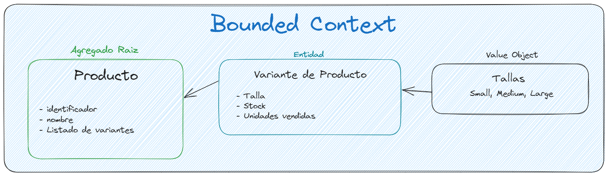

# Prueba Técnica - Backend

## Índice

- [Prueba Técnica - Backend](#prueba-técnica---backend)
  - [Índice](#índice)
  - [Descripción](#descripción)
    - [Enunciado completo](#enunciado-completo)
  - [Desarrollo](#desarrollo)
  - [Tecnologías utilizadas](#tecnologías-utilizadas)
  - [Decisiones de implementación](#decisiones-de-implementación)
  - [Ejecución](#ejecución)
  - [Pruebas](#pruebas)
  - [Creado por](#creado-por)

## Descripción

El objetivo de la prueba es desarrollar una API REST que permita gestionar un listado de productos. Dichos productos deben poder
ser ordenados según varios criterios de ordenación.

### Enunciado completo

Dado un listado de productos que se muestra en una categoría de camisetas se necesita implementar
un algoritmo que permita ordenar ese listado en base a una serie de criterios de ordenación. Cada
criterio de ordenación tendrá un peso asociado de manera que la puntuación de cada producto a
ordenar vendrá dada por la suma ponderada de los criterios.

Los criterios de ordenación definidos serán el criterio de ventas por unidades y el criterio de
ratio de stock, puede que a futuro se añadan nuevos criterios.

El criterio de ventas por unidades dará una puntuación a cada producto basado en el número de
unidades vendidas.

El criterio de ratio de stock dará una puntuación en función de las tallas que contengan stock en
ese momento.

El listado de productos es el siguiente:

|   id | name                       | sales_units | stock               |
| ---: | :------------------------- | ----------: | :------------------ |
|    1 | V-NECH BASIC SHIRT         |         100 | S: 4 / M:9 / L:0    |
|    2 | CONTRASTING FABRIC T-SHIRT |          50 | S: 35 / M:9 / L:9   |
|    3 | RAISED PRINT T-SHIRT       |          80 | S: 20 / M:2 / L:20  |
|    4 | PLEATED T-SHIRT            |           3 | S: 25 / M:30 / L:10 |
|    5 | CONTRASTING LACE T-SHIRT   |         650 | S: 0 / M:1 / L:0    |
|    6 | SLOGAN T-SHIRT             |          20 | S: 9 / M:2 / L:5    |

## Desarrollo

La prueba se implementó utilizando SpringBoot y Java 17, además por ser un ejercicio de prueba se
utilizó una base de datos en memoria H2.

Se siguieron buenas prácticas de diseño de código, se siguió una implementación de la Arquitectura Hexagonal y patrones de diseño de Domain Driven Design.

Se realizó el desarrollo utilizando la metodología Test Driven Development (TDD) y se implementaron pruebas unitarias, de integración y de sistema.

En el historial de commits se puede revisar el proceso de desarrollo implementado y el flujo de pensamiento para resolver la prueba.

## Tecnologías utilizadas

- SpringBoot 3.0
- Java 17
- jUnit 5
- Mockito
- Maven
- Base de datos H2
- Flyway, para la migración de la base de datos
- Swagger, para la documentación de la API
- Docker, para facilitar el despliegue

## Decisiones de implementación

- Se utilizó una base de datos en memoria H2, para facilitar el despliegue y la ejecución de la prueba. Pero podría usarse cualquier otra base de datos relacional.
- Para guardar los datos de las ventas de cada variante se simplificó el modelo y se guardó en la misma entidad de la variante de los productos. En un desarrollo completo este dato debería provenir de un concepto de Ventas u Órdenes de compra. A partir de allí se podría enviar un Evento de Dominio para actualizar ese valor en la variante. Otra opción sería crear un modelo de lectura siguiendo el patrón Command Query Responsibility Segregation (CQRS) y actualizar ese valor en un modelo de lectura, el cual sería el que se utilizaría para consultar los datos de los productos y realizar el filtrado.
- En un sistema con alta carga de productos la ordenación por criterios se podría hacer a nivel de base de datos, para evitar
cargar en memoria los productos y luego ordenarlos. En caso de que se realice por base de datos, los criterios de ordenación se
podrían implementar directamente en la capa de infraestructura según la interfaz de order criteria.
  - Agrego un diagrama para entender las relaciones



- Para modelar los criterios de ordenación dado que una de las premisas era que podían existir nuevos criterios en el futuro se modeló una interfaz que define el comportamiento de un criterio de ordenación el cual será implementado por cada criterio de aceptación nuevo. De este modo es sencillo agregar nuevos criterios en el futuro.

## Ejecución

La prueba puede ser ejecutada utilizando Maven o Docker.

- Para la ejecución utilizando Maven se debe ejecutar el siguiente comando en la raíz del proyecto:

```bash
./mvnw spring-boot:run
```

Para la ejecución utilizando Docker se debe ejecutar el siguiente comando en la raíz del proyecto:

- Para construir la imagen

```bash
docker-compose build
```

- Para ejecutar la imagen

```bash
docker-compose up
```

El servidor estará corriendo en el puerto 8080 por defecto, para consultar documentación en línea y probar la API se puede acceder a la siguiente URL:

```bash
http://localhost:8080/swagger-ui.html
```

## Pruebas

Se implementaron pruebas unitarias, de integración y de sistema. Para ejecutar las pruebas se debe ejecutar el siguiente comando en la raíz del proyecto:

```bash
./mvnw test
```

## Creado por

Gustavo Pastorelli
